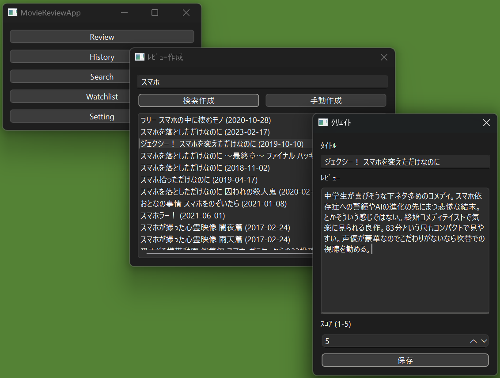
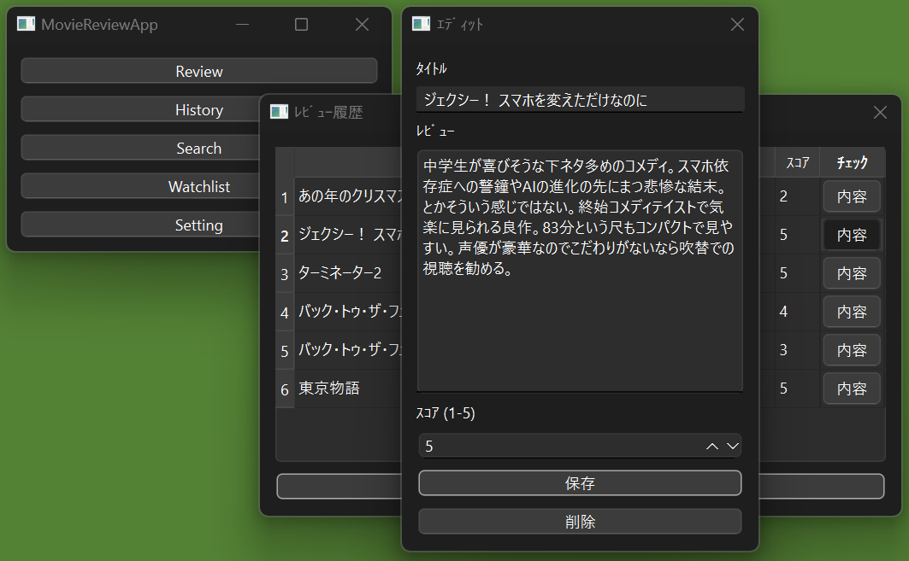
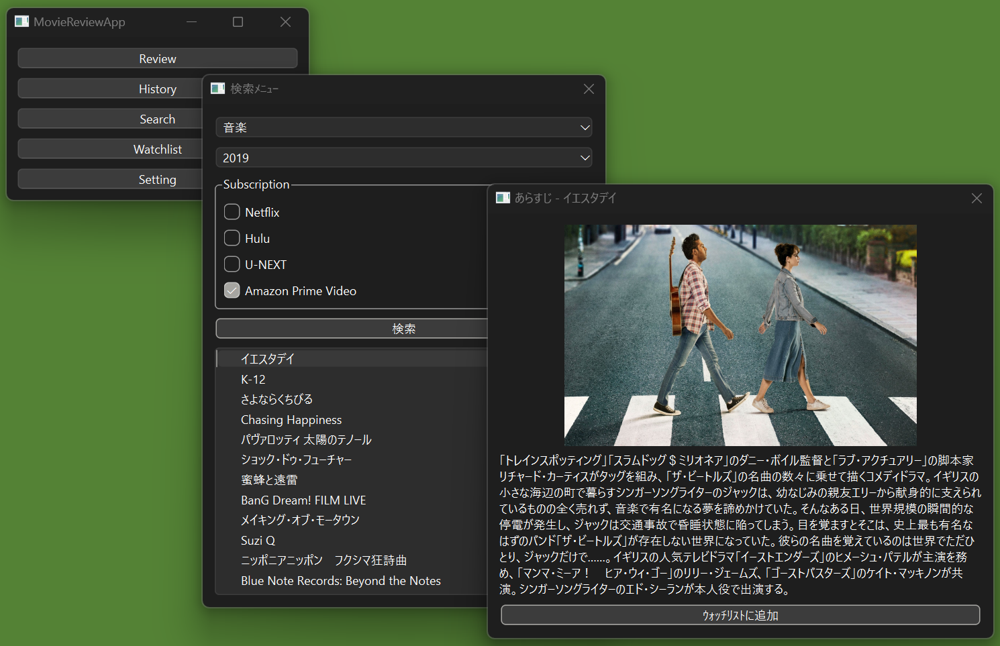
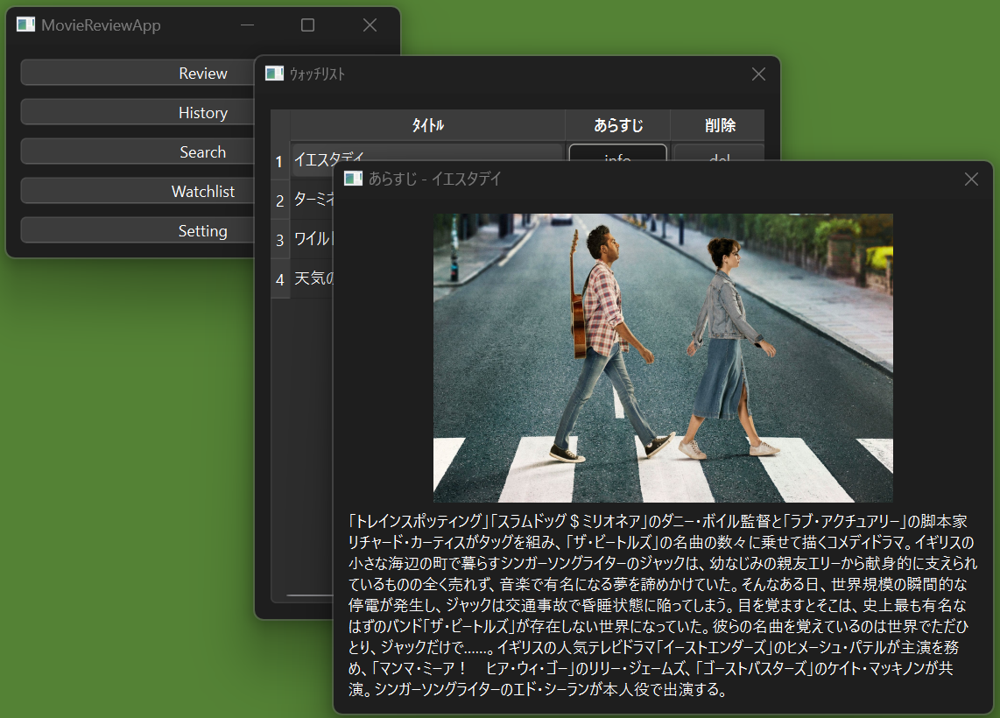
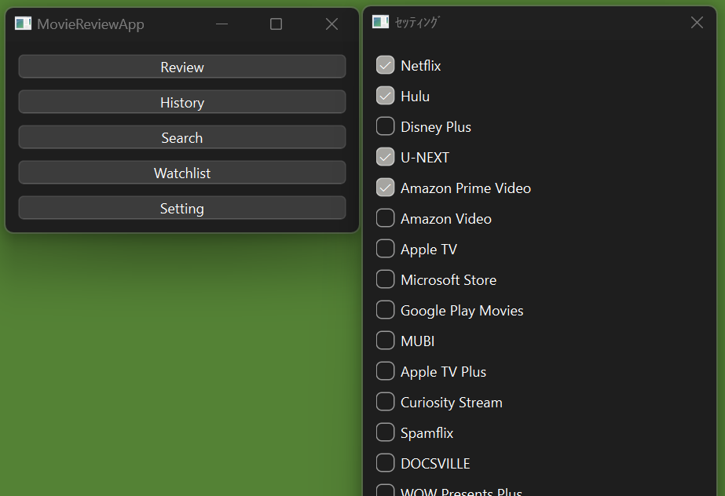

# 映画レビュー＆検索アプリ

映画を見た後の感想を記録したり、サブスクリプションを指定して映画を検索できるアプリケーションです。  
Python学習の一環として生成AIにサポートしてもらいながら作成しました。

---

## プロジェクト概要

**目的**  
アプリケーションの開発を通じて参考書では得られない実践的な知識を習得すること。

**使用技術**  
- フロントエンド    ：PyQt6  
- バックエンド      ：Python  
- データベース      ：SQLite  
- 外部API           ：TMDb API（映画情報の取得）  
- 生成AI支援        ：Codeium(VSCode拡張機能)

**ライセンス**  
このプロジェクトは MIT License のもとで公開されています。  
※非商用目的でご利用ください。

## アプリケーションの概要

### 主な機能
- **映画レビュー機能**  
  見た映画の感想と評価を記録し、管理できます。

- **映画検索機能**  
  サブスクリプションやジャンル、公開年を指定して映画を検索できます。

- **ウォッチリスト機能**  
  気になる映画をリストアップして後で確認できます。

- **サブスクリプション設定**  
  自分が登録しているサービスを指定し、検索結果を絞り込めます。

### ウィンドウ構成と詳細
1. **ホーム**  
   各機能のウィンドウにアクセスできるメニュー。

2. **Review**  
   映画の感想と評価を記録。  
   - 検索作成：映画タイトルの一部を検索して候補を表示、選択すると正式なタイトルを入力してくれる。
   - 手動作成：タイトルを手動入力して感想を記録。公開して間もない作品のレビューを想定。


3. **History**  
   これまでに記録したレビューの一覧を表示。編集、削除が可能。


1. **Search**  
   サブスクリプション、ジャンル、公開年を指定して映画を検索。  
   検索結果から映画の詳細(あらすじ)を確認し、ウォッチリストに追加。


2. **Watchlist**  
   気になる映画の一覧を表示。  
   詳細情報の表示、不要な項目をリストから削除する。


3. **Setting**  
   サブスクリプションの設定。  
   リストアップされた項目から検索対象をカスタマイズ。


### 必須環境
- Python 3.8以上

### 使用方法
1. リポジトリをクローン
```bash
git clone https://github.com/HI-0705/movie_review_app.git
cd movie_review_app
```

2. 依存関係をインストール
```bash
pip install -r requirements.txt
```

3. アプリケーションを起動
```bash
python main.py
```

### 注意事項
TMDb APIを使用しています。APIキーの有効期限やリクエスト制限にご注意ください。
本アプリケーションは学習目的で作成したものであり、
実用性や完全なバグフリーを保証するものではありません。  
作者はソフトウェアに対して一切の動作保証、および責任を負いません。
